# Cracker OWASP Uncrackable Android Level 3

[]()
[]()
[]()
[]()

Ce dépôt contient le rapport d'exécution pas-à-pas et la documentation technique complète pour la résolution du challenge de reverse engineering **LAB 17 : Cracker OWASP UnCrackable Android Level 3**. 

L'objectif de ce laboratoire est d'analyser une application Android durcie, d'identifier ses mécanismes de défense (anti-root, anti-debug, anti-tampering) au niveau Java et natif, de les contourner en modifiant le code intermédiaire Smali et en patchant la bibliothèque native `.so` sous Ghidra, puis d'extraire la clé secrète chiffrée.

---

## Table des Matières

1. [Architecture & Fonctionnement](#-architecture--fonctionnement)
2. [Prérequis & Environnement de Test](#-prérequis--environnement-de-test)
3. [Étape 1 : Analyse Statique Initiale (JADX-GUI)](#étape-1--analyse-statique-initiale-jadx-gui)
4. [Étape 2 : Décompilation de l'APK (apktool)](#étape-2--décompilation-de-lapk-apktool)
5. [Étape 3 : Patch Smali (Anti-Root & Anti-Tampering)](#étape-3--patch-smali-anti-root--anti-tampering)
6. [Étape 4 : Patch de la Bibliothèque Native (Ghidra)](#étape-4--patch-de-la-bibliothèque-native-ghidra)
7. [Étape 5 : Reconstruction, Signature et Installation de l'APK](#étape-5--reconstruction-signature-et-installation-de-lapk)
8. [Étape 6 : Analyse Native & Extraction de la Clé](#étape-6--analyse-native--extraction-de-la-clé)
9. [Questions de Réflexion & Synthèse](#questions-de-réflexion--synthèse)
10. [⚠️ Avertissement Légal](#%EF%B8%8F-avertissement-légal)

---

## Architecture & Fonctionnement

La sécurité de l'application **OWASP UnCrackable Level 3** repose sur un modèle hybride de protections logicielles, combinant des barrières de sécurité en Java et au niveau binaire natif (C/C++) :

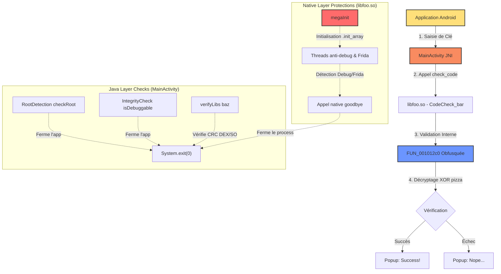

* **Couche Java** : Vérifie l'état root de l'appareil (via la présence de binaires su, de tags de test-keys ou d'applications de super-utilisateur), le flag de débogage Android, et le hachage d'intégrité DEX/bibliothèques calculé via la fonction native `baz()`. Si une anomalie est détectée, le flag global `tampered` passe à `31337` et déclenche un popup d'erreur fermant l'application.
* **Couche Native (`libfoo.so`)** : Dès le chargement en mémoire de la bibliothèque via `.init_array`, la fonction native `megaInit()` lance des threads d'anti-débogage (surveillance active de `ptrace`) et de détection de Frida (lecture continue de `/proc/self/maps` pour traquer l'agent Frida). Si un débogueur ou Frida est détecté, elle appelle la fonction native `goodbye()` qui termine immédiatement le processus Android.
* **Algorithme de Validation** : La validation finale de la clé est déléguée à une fonction native obfusquée par aplatissement de graphe de contrôle (Control Flow Flattening via O-LLVM/Tigress) qui déchiffre une constante en mémoire par un XOR répétitif avec la clé `"pizza"`.

---

## Prérequis & Environnement de Test

Ce laboratoire a été réalisé sous Windows 11 avec les spécifications techniques suivantes :
* **Système d'exploitation :** Windows 11 Home 23H2
* **Python :** version 3.10+
* **ADB (Android Debug Bridge) :** version 1.0.41 (intégré au SDK Android)
* **Apktool :** version 2.10.0 (pour l'extraction et la reconstruction Smali)
* **Ghidra :** version 11.1 (pour le reverse-engineering de la bibliothèque ELF)
* **Émulateur Cible :** Pixel 4 (système émulé x86_64, API 37)

---

## Étape 1 : Analyse Statique Initiale (JADX-GUI)

En ouvrant l'APK d'origine `apks/original/UnCrackable-Level3.apk` dans JADX-GUI, nous analysons le point d'entrée principal.

### 1. Intégrité des bibliothèques (`verifyLibs`)
L'application calcule dynamiquement les sommes de contrôle (CRC) de ses propres fichiers `.so` compilés ainsi que du bytecode exécutable principal `classes.dex` :

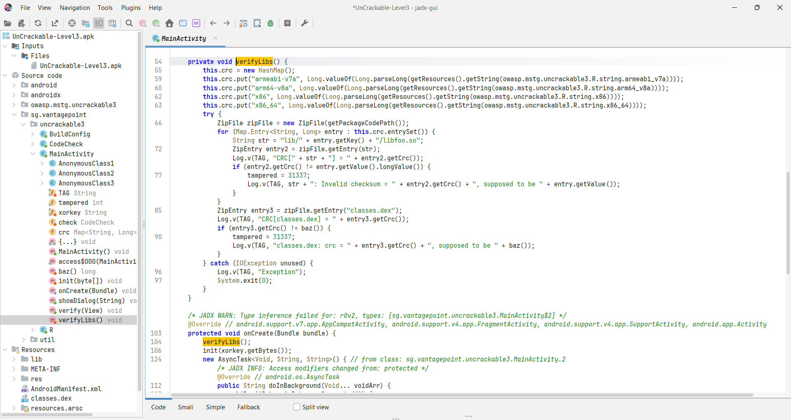

La fonction native `baz()` (déclarée dans le code natif) renvoie la somme attendue pour le fichier `classes.dex`. Si un patch ou une altération est détecté, la variable `tampered` prend la valeur `31337`.

### 2. Le point d'entrée `onCreate`
Dans `onCreate()`, l'application effectue l'intégralité des vérifications Java en ligne :

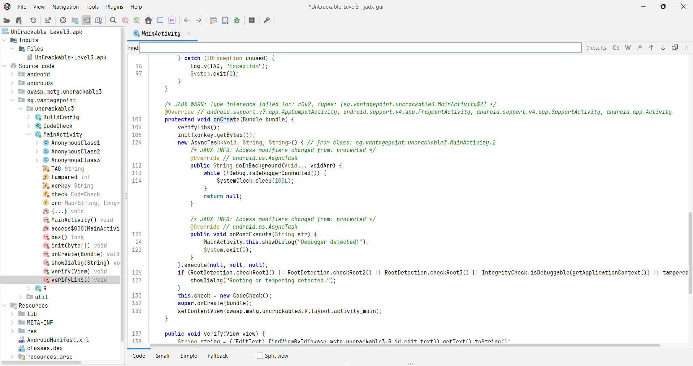

Si `RootDetection.checkRoot1()` (ou 2, ou 3), `IntegrityCheck.isDebuggable()`, ou si la variable `tampered` est égale à `31337`, l'application appelle la fonction d'affichage de popup `showDialog()`. Ce popup bloque l'utilisateur et quitte le processus lors du clic sur le bouton "OK".

---

## Étape 2 : Décompilation de l'APK (apktool)

Pour pouvoir modifier le comportement de la classe Java compile `MainActivity`, nous devons extraire les fichiers sous forme de bytecode intermédiaire **Smali**.

Nous utilisons la commande de décompilation suivante :

```powershell
# Décompilation de l'APK d'origine vers le dossier decompiled/original/
apktool d apks/original/UnCrackable-Level3.apk -o decompiled/original
```

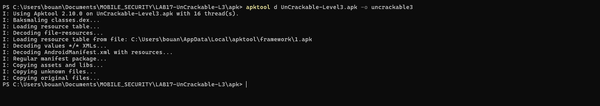

Cette commande extrait les ressources de l'application, les bibliothèques natives compilées (dans `decompiled/original/lib/`), et décompile le code DEX en fichiers `.smali` éditables dans le sous-dossier `smali/`.

---

## Étape 3 : Patch Smali (Anti-Root & Anti-Tampering)

Afin d'empêcher l'application de se fermer en détectant notre émulateur rooté et la modification des fichiers, nous patchons le fichier `decompiled/original/smali/sg/vantagepoint/uncrackable3/MainActivity.smali`.

### 1. Recherche de la cible `showDialog`
Nous ouvrons le fichier dans notre éditeur de code pour localiser la déclaration et l'utilisation de `showDialog` :

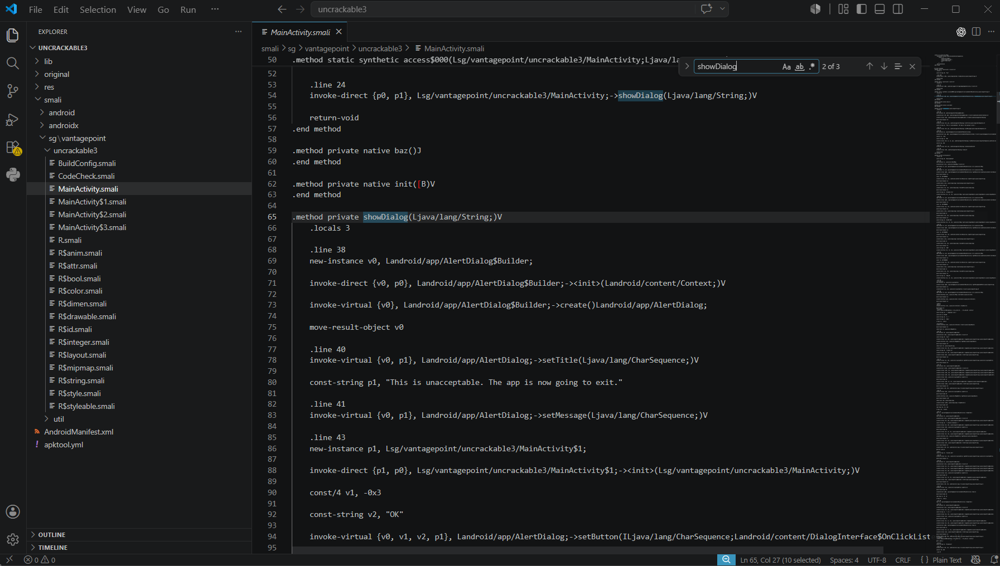

### 2. Analyse du bloc de détection dans `onCreate`
Dans la méthode `onCreate`, les tests de détection se dirigent tous vers le label `:cond_0` en cas d'alerte, provoquant le crash ou l'appel au popup de fermeture :

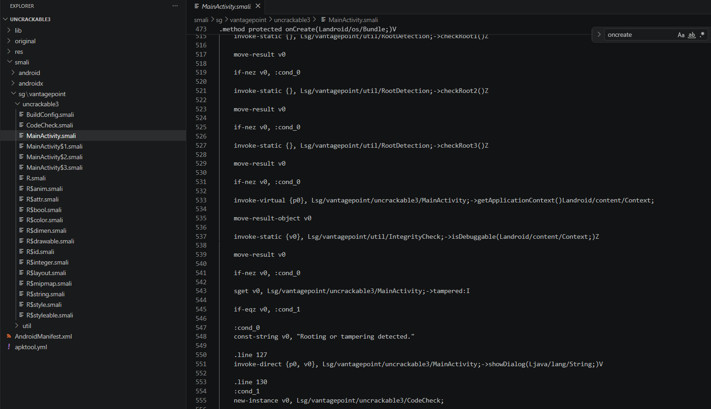

### 3. Application du patch inconditionnel dans `onCreate`
Pour neutraliser ces détections Java, nous remplaçons le bloc d'erreur sous `:cond_0` par un saut inconditionnel `goto :cond_1` pour forcer l'application à poursuivre le chargement de son activité et l'instanciation de sa logique principale :

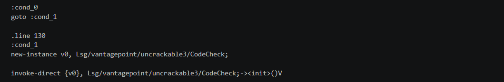

### 4. Désactivation complète de la méthode `showDialog`
Pour garantir qu'aucun appel indirect ne puisse lancer le popup bloquant, nous vidons entièrement la méthode `showDialog` pour qu'elle effectue un retour immédiat (`return-void`) :

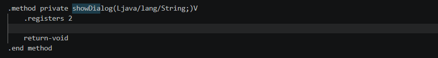

---

## Étape 4 : Patch de la Bibliothèque Native (Ghidra)

Même après avoir désactivé les verrous en Java, l'application crashe instantanément en raison des détections anti-debug et anti-Frida gérées par la bibliothèque native `libfoo.so`. Nous allons la modifier dans Ghidra.

### 1. Importation de `libfoo.so`
Nous chargeons la version de la bibliothèque native correspondant à notre architecture (ici `decompiled/original/lib/x86_64/libfoo.so`) dans Ghidra :

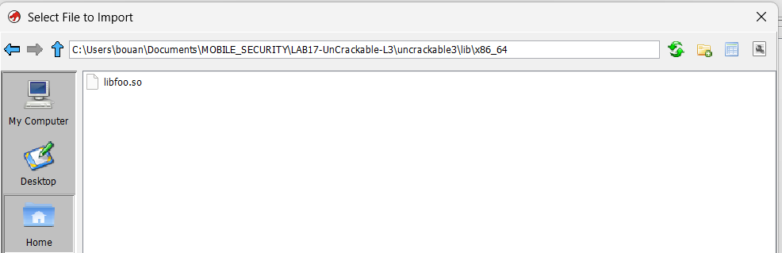

### 2. Localisation et analyse de la fonction `megaInit`
Nous recherchons la fonction d'initialisation **`megaInit`** (ou `_Z8megaInitv`), responsable du démarrage des threads de détection :

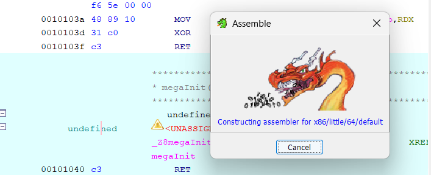

### 3. Application du patch `RET` sur `megaInit`
Pour court-circuiter complètement le lancement des threads d'anti-debug/anti-Frida, nous sélectionnons la toute première instruction de `megaInit`, effectuons un clic droit -> **Patch Instruction** et la remplaçons par une instruction de retour immédiat **`RET`** (code hexadécimal `c3` sur x86_64) :

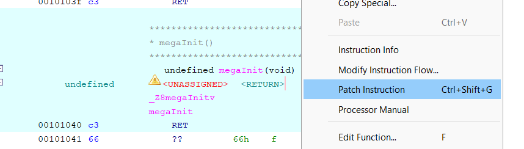

### 4. Exportation du binaire natif patché
Nous exportons la bibliothèque modifiée depuis Ghidra en prenant soin de sélectionner le format **Original File** :

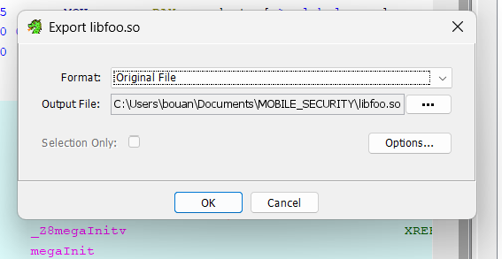

Le fichier exporté est sauvegardé dans notre dossier de travail pour remplacer l'ancienne bibliothèque dans `decompiled/patched/lib/x86_64/libfoo.so`.

---

## Étape 5 : Reconstruction, Signature et Installation de l'APK

Une fois les correctifs Smali et la bibliothèque native ELF patchés dans notre dossier de travail, nous procédons aux étapes d'assemblage.

### 1. Première compilation de l'APK patchée
Nous exécutons `apktool` pour recompiler le répertoire de travail sous forme d'une nouvelle archive APK :

```powershell
# Commande de reconstruction
apktool b decompiled/patched -o apks/patched/UnCrackable-Level3-patched.apk
```

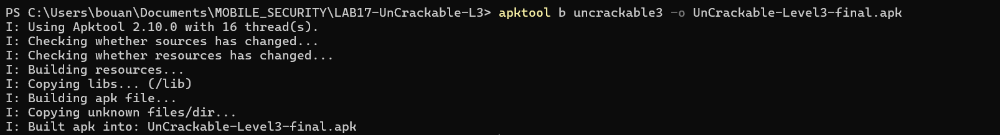

### 2. Validation de la reconstruction
La compilation du projet produit notre fichier APK modifié :

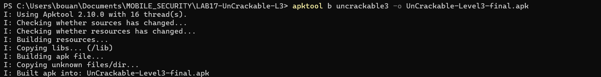

### 3. Signature cryptographique de l'APK (keystore Android)
Pour qu'Android accepte d'installer l'application modifiée sur l'émulateur, nous devons signer le binaire à l'aide de notre clé de développement :

```powershell
# Signature de l'APK patchée
apksigner sign --ks "$env:USERPROFILE\.android\debug.keystore" --ks-pass pass:android apks/patched/UnCrackable-Level3-patched.apk
```

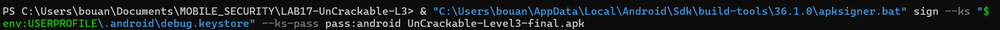

### 4. Désinstallation de l'ancienne version & déploiement
Pour éviter les conflits de signature d'application (*signatures mismatch*), nous désinstallons le package original et installons l'APK patchée :

```powershell
# Désinstallation
adb uninstall owasp.mstg.uncrackable3

# Installation
adb install -r apks/patched/UnCrackable-Level3-patched.apk
```

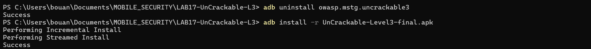

### 5. Validation du bypass au démarrage
Nous lançons l'application sur notre émulateur Pixel 4. L'application démarre normalement sur son interface de saisie de clé sans afficher d'erreur de sécurité ni se fermer :

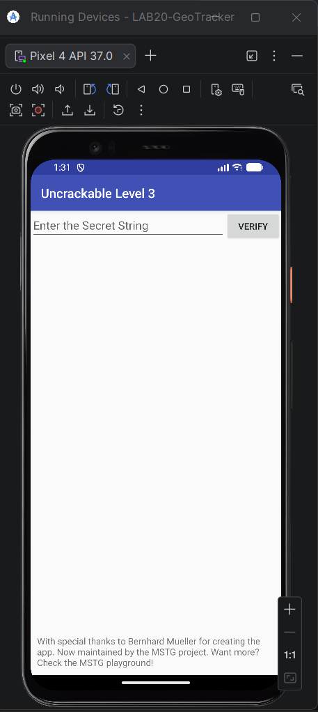

---

## Étape 6 : Analyse Native & Extraction de la Clé

### 1. Analyse statique de l'obfuscation de la clé JNI
Dans Ghidra, nous naviguons vers la fonction interne de validation JNI appelée par `check_code(String)` (à savoir `FUN_001012c0`). Celle-ci est lourdement obfusquée par aplatissement de flux (LCG, allocations multiples). Cependant, les écritures finales de la clé décryptée s'effectuent directement en mémoire dans le buffer de retour `param_1` sous forme de QWORDs écrits en Little-Endian :

```c
*(undefined8 *)(param_1 + 0x10) = 0x14130817005a0e08;
*(undefined8 *)(param_1 + 8)    = 0x15131d5a1903000d;
*(undefined8 *)param_1          = 0x1549170f1311081d;
```

### 2. Conversion Little-Endian en tableau d'octets
En lisant chaque QWORD octet par octet de droite à gauche (poids faible en premier) :
*   `0x1549170f1311081d` → `1d 08 11 13 0f 17 49 15`
*   `0x15131d5a1903000d` → `0d 00 03 19 5a 1d 13 15`
*   `0x14130817005a0e08` → `08 0e 5a 00 17 08 13 14`

Le tableau d'octets chiffré final est :
`1d0811130f1749150d0003195a1d1315080e5a0017081314` (24 octets).

### 3. Script Python de décodage XOR
La bibliothèque native applique une opération XOR avec la clé `"pizza"` répétée. Nous utilisons le script Python de décodage suivant pour retrouver le mot de passe en clair :

```python
# === DÉCODAGE DU SECRET - UNCRACKABLE L3 ===
encoded = bytes.fromhex("1d0811130f1749150d0003195a1d1315080e5a0017081314")
xor_key = b"pizzapizzapizzapizzapizzapizza" # 24 octets

secret = bytes(a ^ b for a, b in zip(encoded, xor_key))
print("🔑 Clé secrète trouvée :", secret.decode('utf-8'))
```

L'exécution de ce script affiche :
`🔑 Clé secrète trouvée : making owasp great again`

### 4. Validation finale de la clé
Nous saisissons la chaîne de caractères **`making owasp great again`** dans le champ de saisie de l'application et cliquons sur **VERIFY** :

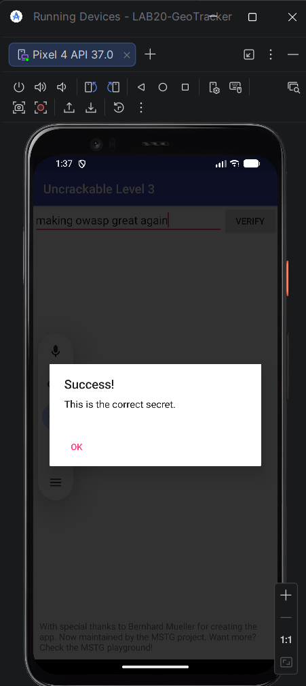

Le popup de confirmation d'authentification s'affiche avec le message **"Success! This is the correct secret."**. Le challenge est résolu !

---

## Questions de Réflexion & Synthèse

1.  **Pourquoi l'obfuscateur ajoute-t-il autant d'instructions répétitives ?**
    L'obfuscateur (de type O-LLVM/Tigress) cherche à gonfler artificiellement la complexité cyclomatique du code. En insérant du faux code et des structures de boucle aplaties (Control Flow Flattening), il rend l'analyse statique humaine longue et complexe, et perturbe la génération de pseudo-code par les décompilateurs automatiques.
2.  **Pourquoi les écritures finales dans `param_1` sont-elles plus importantes que les 90 `malloc` ?**
    Les allocations multiples et les calculs intermédiaires complexes servent uniquement de bruit de fond (données factices). Seules les écritures de QWORDs à la fin de la fonction modifient le buffer de destination `param_1` qui sera comparé à la saisie de l'utilisateur pour valider la clé.
3.  **Quel avantage apporte une vérification native comparée à une vérification en Java ?**
    Le code Java/DEX est extrêmement simple à décompiler en code source lisible. Le code natif compiles sous forme d'instructions machine (ELF) exige l'utilisation de désassembleurs comme Ghidra ou IDA Pro, et permet de mettre en place des techniques de bas niveau pour surveiller l'intégrité de l'OS (`ptrace`, lecture des fichiers `/proc`) difficiles à mettre en œuvre en Java.
4.  **Comment un développeur défensif pourrait-il rendre cette clé encore plus complexe à extraire ?**
    *   **White-Box Cryptography** : Intégrer les clés cryptographiques directement au sein de tables mathématiques complexes pour éviter que le secret ne se retrouve déchiffré en clair en mémoire.
    *   **Attestation en ligne** : Déléguer la validation du mot de passe à un serveur sécurisé distant, couplé à une attestation d'intégrité matérielle (comme Android Play Integrity API) pour bloquer l'usage d'émulateurs modifiés ou débogués.

---

## ⚠️ Avertissement Légal

Ce guide et les techniques de reverse engineering présentés sont partagés uniquement à des fins éducatives, d'apprentissage académique et de recherche en sécurité. L'analyse et la modification d'applications tierces sans l'autorisation expresse de l'éditeur sont interdites par la loi. Les auteurs déclinent toute responsabilité quant à l'utilisation malveillante ou inappropriée de ces ressources.
